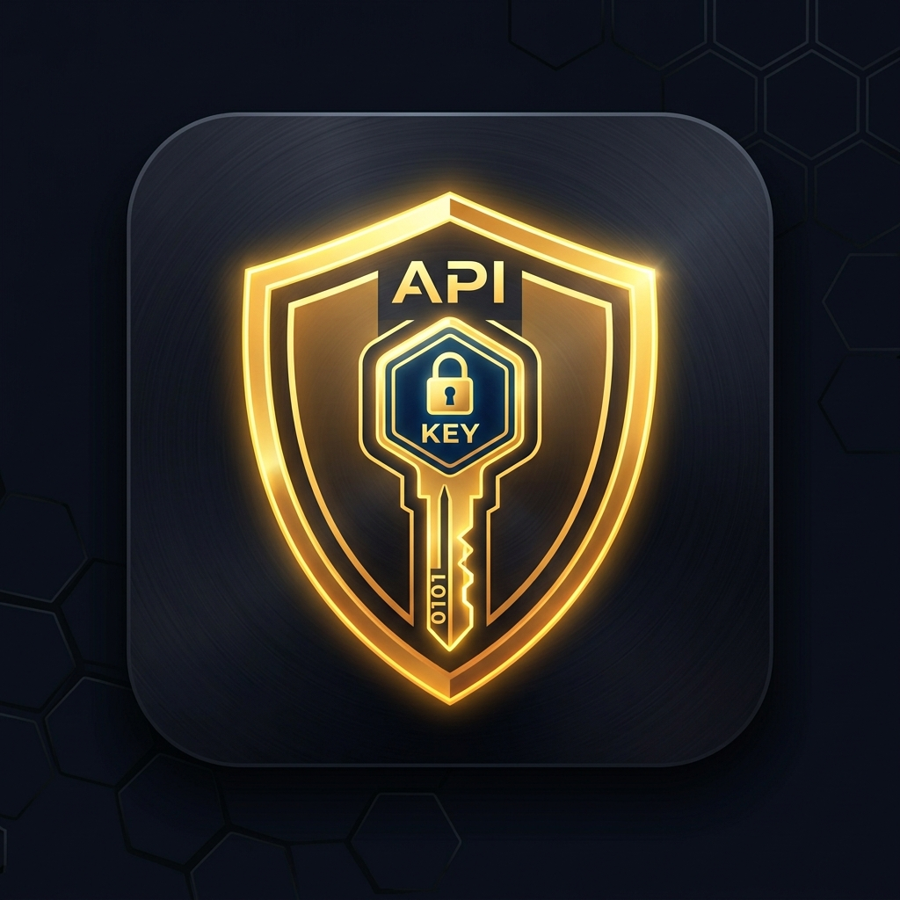

<!-- prettier-ignore -->
<div align="center">
  

  # KeyNest
  
  *Ultra-fast, encrypted API Key & Developer Secret Vault for Android*

  [](https://github.com/ak-a-ra/KeyNest/actions)
  [](https://developer.android.com/)
  [](https://kotlinlang.org/)
  
  ⭐ If you like this project, star it on GitHub!

  [Overview](#overview) • [Features](#features) • [Security](#security) • [Get Started](#get-started) • [Architecture](#architecture)
</div>

KeyNest is a single-activity Android vault for developers to securely store, organize, reveal, copy, import, and export API keys and related secrets. It uses modern Android development practices, featuring Jetpack Compose, Material Design 3, and Keystore-backed AES-256-GCM encryption.

## Overview

Managing API keys, environment variables, and developer secrets on mobile devices can be cumbersome and insecure. KeyNest solves this by providing a lightweight, fast, and secure vault. Your secrets are encrypted at rest using Android Keystore and never persisted in plaintext. 

> [!NOTE]  
> KeyNest intentionally disables Android Auto-Backup (`android:allowBackup="false"`) to prevent sensitive secrets from being extracted through ADB or cloud backups.

## Features

- **Encrypted Storage:** Secrets live in Room and `EncryptedSharedPreferences`, protected by Android Keystore and AES-256 GCM. Plaintext never touches the disk.
- **Real-Time Deep Search:** Instantaneous, zero-latency multi-field querying across the encrypted vault, matching titles, tags, providers, and URLs.
- **Smart Clipboard:** Copy values with visual feedback and an automatic clipboard-clear timer. On Android 13+, copied secrets use the `EXTRA_IS_SENSITIVE` flag to prevent clipboard snooping.
- **Clipboard Detection:** Recognizes common API key formats (OpenAI, Gemini, Anthropic, Stripe, AWS, etc.) and offers to save them automatically.
- **Multi-Tag System:** Organize keys with interactive tags across workspaces, clients, microservices, and projects.
- **Grid vs List Views:** Fluid toggle between a compact list and a 2-column masonry grid layout with persistent layout preferences.
- **Color Coding:** Distinguish API keys visually using a contrast-safe pastel background palette.
- **.env Import/Export:** Import configuration files in bulk or export saved values as a formatted `.env` file.
- **Encrypted Vault Backups:** Export the entire encrypted vault to portable `.keynest` files, protected by PBKDF2 (100k rounds) + AES-256-GCM for cross-device migration and cold storage.

## Security

Security is the foundational principle of KeyNest:

1. **Keystore-Backed:** Uses Android's `MasterKey` and AES-256 GCM for all secret fields.
2. **Masked by Default:** Secret values are always masked; revealing a value requires explicit action.
3. **No Secret Logs:** Strict enforcement against writing API key values to Logcat or any debug logs.
4. **Explicit Failure Handling:** Encryption failures are explicit and atomic. They never fall back to plaintext.

> [!WARNING]
> Legacy vault data migrations require an explicit recovery path. Malformed ciphertext is never treated as plaintext.

## Get Started

### Requirements

- Android Studio Ladybug, Meerkat, or newer
- Android SDK 34 or newer
- JDK 17 or newer

### Build and Run

1. Clone the repository.
2. Open the project in Android Studio.
3. Build a debug APK and run it on a device or emulator:

   ```bash
   ./gradlew assembleDebug
   ```

> [!TIP]
> KeyNest is configured with [`no-mistakes`](https://github.com/kunchenguid/no-mistakes) via `.no-mistakes.yaml` for pre-push validation (unit tests, linting, code review, documentation sync). You can run the pipeline manually using `no-mistakes axi run --intent "<goal>"`.

## Architecture

KeyNest strictly follows a modular clean architecture:

- `core/database`: Room schema, entity configuration, and Data Access Objects (DAO).
- `core/model`: Persistent domain models and provider presets.
- `core/repository`: Encryption-aware persistence boundaries.
- `core/security`: Android Keystore AES-256-GCM cryptography, encrypted preferences, and backup encryption.
- `core/files`: Storage Access Framework (SAF) and file I/O operations.
- `core/designsystem`: Material Design 3 tokens, colors, and typography.
- `feature/*`: Presentation layer featuring Jetpack Compose screens, ViewModels, and adaptive layouts.
